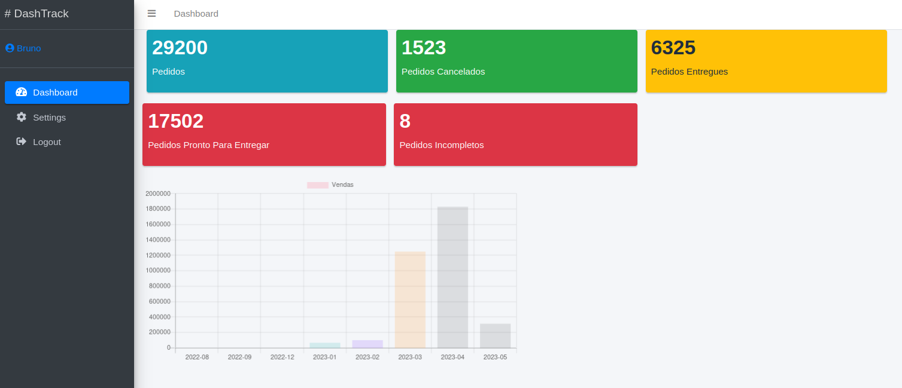
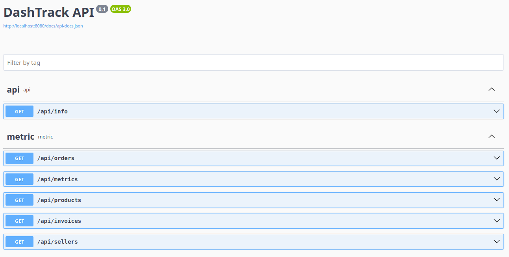
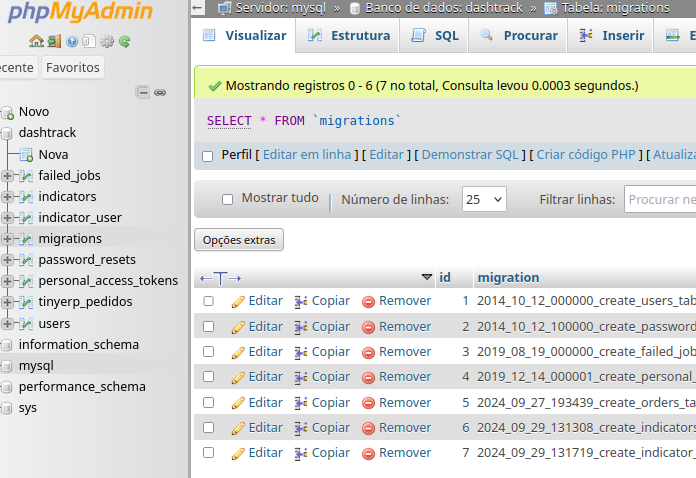

# DashTrack

[](https://github.com/devbrunocorrea/dashtrack/actions/workflows/laravel-tests.yaml)

Micro-SaaS para Visualização de Indicadores de Negócios com Integração ao TinyERP


## Tecnologias:
- [x] PHP
- [x] Laravel
- [x] Laravel Breeze
- [x] OpenAPI (L5-Swagger)
- [x] AdminLTE
- [x] Integração com TinyERP 
- [x] Docker (sem Laravel/Sail)
- [x] PHPMyAdmin 
- [x] Nginx

## Requisitos:
- [x] docker
- [x] docker-compose

## Configuração:
```
TINYERP_ENDPOINT=https://api.tiny.com.br/api2
TINYERP_TOKEN=TOKEN
```

## Execução Inicial:
```
./setup
```

## Parar execução:
```
./stop
```

## Iniciar novamente:
```
./start
```

## Testes:
```
php artisan test
```

## Acesso:
http://127.0.0.1:8080

## API
http://127.0.0.1:8080/api

## Documentação da API - OpenAPI (Swagger)
http://127.0.0.1:8080/api/documentation


## PHPMyAdmin:
http://127.0.0.1:8081
* Login: `root`
* Senha: `root`



### Principais rotas:
- /api
- /api/documentation
- /register
- /login
- /logout
- /dashboard
- /dashboard/settings

### Commands:
```bash
php artisan dashtrack:check
```
